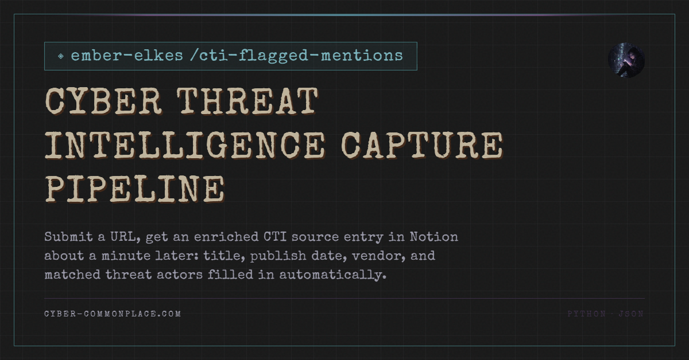

# Cyber Threat Intelligence Capture Pipeline



Began as a project that collects flagged mentions of threat actors and feeds them to a WordPress plugin for review. It is used to collect recent news mentions of threat actors. However, I needed something faster than the 6-hour cycle it used to capture URLs for threat actor research. The goal was to create something I could open on my computer, paste a link, click a button, and have it automatically send the URL to Notion and fill in the row in the table. This cuts down on the time spent collecting references and frees up time for actually looking at them. 

## How it works

Submit a URL, get an enriched CTI source entry in Notion about a minute later: title, publish date, vendor, and matched threat actors filled in automatically.

The repo holds two pipelines that share one alias index:

- **Capture** — a URL you submit by hand becomes a fully populated row in the Notion inbox (*Threat Actor Information Sources*).
- **Collector** — a scheduled RSS run that publishes flagged mentions to WordPress.

Both resolve threat actor names through the same actors.json, so an alias added for one improves the other.

```
GUI client  ──POST──▶  GitHub API  ──▶  capture.yml  ──▶  capture.py  ──▶  Notion
 (Windows)          repository_dispatch      runner        fetch → extract →
                     type: capture-url                     match → resolve →
                                                           decide → write
```

The GUI's job ends at the POST. A 204 from GitHub confirms the message was received, not that the run succeeded; outcomes appear in Notion.

| **Stage** | **Function** | **Notes** |
| --- | --- | --- |
| Dedup | notion_entry_exists | Runs before fetching — the Notion query is cheaper than a webpage |
| Fetch | fetch_article | Browser User-Agent; returns (kind, payload) so PDFs branch cleanly |
| Extract | extract_content | trafilatura for HTML, pypdf for PDFs — text, title, publish date |
| Match | common.match_actors | Alias patterns run against title + text |
| Vendor | derive_vendor | URL → clean domain |
| Resolve | resolve_actor_ids | Canonical name → Notion page ID, **get-or-flag** |
| Decide | decide | Status and review reason |
| Write | create_entry / update_entry | Create on capture, PATCH in place on reprocess |

<aside>
💡

**Note:** Nothing submitted disappears. Every failure path still writes an entry carrying the URL, the source domain, and a stated reason, flagged Needs Review.

</aside>

## Setup

### 1. Notion

You need the **data source ID**, not the database ID from the browser URL; the API endpoint wants the former, and using the latter returns a 404. Run diag.py to list data sources via the search API and to dump property schemas (property names are case- and wording-sensitive; the actor title property is Primary Name, not Name).

Share both the inbox database and the Threat Actor Intelligence Database with your Notion integration.

### 2. Repository secret

Add the Notion integration token as a repo secret named **TAS_NOTION_TOKEN**, and reference that exact name in each workflow's env: block. GitHub substitutes an empty string for a missing secret rather than failing, so a typo here surfaces later as an unexplained 401 from Notion.

### 3. Local credentials

common.get_secret(name, config_key) resolves credentials in a fixed order:

1. Environment variable
2. %APPDATA%\cti-capture\config.json
3. Loud failure naming both locations searched and the key expected

Environment wins so a runner can never read a stale local file and a local override stays possible. The config file lives outside any Git-tracked directory:

```json
{
  "notion_token": "ntn_...",
  "github_pat": "github_pat_...",
  "github_repo": "<owner>/cti-flagged-mentions"
}
```

### 4. Desktop client

Point a desktop shortcut at the .pyw in gui/ for a windowless launch. It reads the config file above; no credentials are typed into the window or held in a session.

### 5. Dependencies

```powershell
pip install -r requirements.txt
```

## Usage

**Capture** — paste a URL into the GUI and submit. Or fire the dispatch directly:

```powershell
curl.exe -X POST https://api.github.com/repos/<owner>/cti-flagged-mentions/dispatches `
 -H "Accept: application/vnd.github+json" `
 -H "Authorization: Bearer $env:GITHUB_PAT" `
 -d '{\"event_type\":\"capture-url\",\"client_payload\":{\"url\":\"https://example.com/report\"}}'

```

<aside>
💡

PowerShell mangles single-quoted JSON — use --data-raw with escaped double quotes, or the GUI.

</aside>

```bash
curl -X POST https://api.github.com/repos/<owner>/cti-flagged-mentions/dispatches \
  -H "Accept: application/vnd.github+json" \
  -H "Authorization: Bearer $GITHUB_PAT" \
  -d '{"event_type":"capture-url","client_payload":{"url":"https://example.com/report"}}'
```

**Reprocess** — tick the Reprocess checkbox on any inbox rows during triage, then run the **reprocess** workflow from the Actions tab. It re-runs each ticked row through the same pipeline, updates the page in place, and unticks the box on success. Tick several and run once for a batch.

**Regenerate the alias index:**

```powershell
python generate_actors.py
```

Dry-run first and diff before committing:

```powershell
$env:ACTORS_FILE="actors_generated.json"; python generate_actors.py
```

```bash
ACTORS_FILE=actors_generated.json python generate_actors.py && git diff --no-index actors.json actors_generated.json
```

**Local run:**

```powershell
$env:CAPTURE_URL="https://example.com/report"; python capture.py; $env:REPROCESS=1; python capture.py
```

```bash
CAPTURE_URL="https://example.com/report" python capture.py REPROCESS=1 python capture.py
```

## Data Files

**actors.json** — generated from the Notion actor database and the alias tracking database, merged with variants.json, then committed. Generation is build-time rather than runtime so git history records when alias coverage changed and why, and so every capture doesn't take a Notion dependency. Writes are atomic (temp file plus os.replace), so a partial failure can never leave a truncated index that both pipelines would silently trust.

All alias statuses are indexed — Current, Legacy, Deprecated and Subset. Legacy and Deprecated names appear in older articles, which is exactly when matching needs them.

**variants.json** — hand-maintained orthographic variants: spacing differences like CyberAv3ngers / Cyber Av3ngers, and published misspellings such as MITRE ATT&CK's Soldiers of Soloman, which propagate into prose and therefore need matching.

Notion holds *names*; variants.json holds *spellings*. An alias page in Notion carries vendor provenance, a lifecycle status, and a first-used date; a spacing variant is the same name rendered differently, and storing it as an alias would be a category error in a database used for naming-conventions research.

Every variant is also a false-positive surface, so the file grows out of *Needs Review* triage, not brainstorming.

**Drift check** — drift_checks.yml runs weekly, regenerates to a scratch file, and fails if it differs from the committed actors.json. It alarms; it never writes or commits. An auto-committing version would have shipped a false APT38/Lazarus attribution straight into both pipelines, but that one was caught in a manual dry-run diff. If drift starts firing weekly during backfill, the next step is a PR-opening variant, not auto-commit.

## Design notes

**Dispatch, not polling.** The original complaint was a 6-hour delay; a cron sweep would have replaced it with a 15-minute one.

**One repo, two pipelines, one shared module.** Separate repos would have forced common.py to become a published package or be copy-pasted.

**Libraries don't read config; applications do.** common.py reads no environment variables at import time; get_secret is a pure function, so collector.py, which has no Notion credentials and wants none, is unaffected by machinery it doesn't use.

**Actor resolution is get-or-flag, not get-or-create.** The Threat Actor Intelligence Database is a curated analytical artifact; an unresolvable name flags for triage rather than auto-creating a stub page.

**A required credential fails at startup, never returns None.** A missing credential announces itself where it's missing.

**One entry, multiple actor relations.** Supports "show me every source for actor X" from the actor's own page, via the reverse Captured Sources property.

**Match provenance is recorded.** Matched Aliases stores which alias strings actually hit.

**Reprocess updates in place.** Delete-and-recreate would be simpler code but would lose created-time and any manual annotations added during triage. update_entry sends every property including empties, so a review reason that no longer applies is cleared rather than left stale, and the untick rides in the same PATCH after success; a crash mid-update leaves the row still flagged for retry.

**The reprocess trigger lives in Notion,** because the need for it is discovered while looking at flagged rows.

**Credentials live in files, not sessions or source,** and the dispatch payload passes through an env: block rather than shell interpolation.

## Known Limitations

- **Bot-challenged sites** (Cloudflare interstitials, CDN 403s) can't be fetched; they flag with the HTTP status as the reason.
- **Scanned or image-only PDFs** extract no text; there's no OCR. Caught by the thin-text check.
- **Some PDF encodings** defeat pypdf (UTF-16 content streams). Failures include the parser error in the reason.
- **PDF titles are often absent,** so those rows fall back to the URL as the title.
- **Publish dates are best-effort** and omitted when absent rather than guessed.
- **Title cleanup:** site branding suffixes like | Tenable® currently persist.
- **Broad except blocks** in the PDF branch and reprocess loop keep one bad input from aborting a run, but can disguise programmer errors as data errors. Including the exception type in the message mitigates this.
- **actors.json regeneration is manual.** The drift check reports staleness; it doesn't fix it.
- **CAPTURE_URL is still an environment variable** for local runs, unlike the token. A command-line argument would suit a per-run value better.